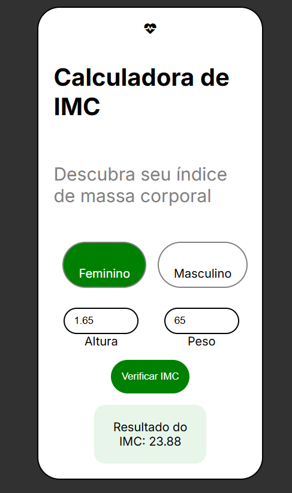

# Calculadora de IMC

Calculadora de Índice de Massa Corporal (IMC) com back-end em Java (Spring Boot) e front-end em HTML, CSS e JavaScript puro. Projeto criado como parte do meu aprendizado em desenvolvimento de sistemas.

## Demonstração



## Funcionalidades

- Cálculo do IMC a partir de peso e altura informados pelo usuário
- Seleção de sexo (feminino/masculino)
- Interface visual com feedback do resultado calculado
- Comunicação entre front-end e back-end via API REST

## Tecnologias utilizadas

**Back-end**
- Java 17
- Spring Boot 4.1
- Maven

**Front-end**
- HTML5
- CSS3 (Flexbox)
- JavaScript (Fetch API)
- Google Fonts (Inter)
- Font Awesome (ícones)

## Estrutura do projeto

```
imc/
├── imc-backend/     API REST em Java/Spring Boot
├── imc-frontend/    Interface visual em HTML/CSS/JS
└── README.md
```

## Como rodar o projeto

### Pré-requisitos
- Java 17 ou superior
- IntelliJ IDEA (ou outra IDE com suporte a Maven)
- VSCode com a extensão Live Server (ou outro servidor local)

### Back-end

1. Abra a pasta `imc-backend` no IntelliJ IDEA
2. Rode a classe `ImcBackendApplication`
3. O servidor vai subir em `http://localhost:8080`

### Front-end

1. Abra a pasta `imc-frontend` no VSCode
2. Clique com o botão direito em `index.html` e selecione **Open with Live Server**
3. A aplicação abrirá em `http://127.0.0.1:5500`

**Importante:** o back-end precisa estar rodando para que o cálculo do IMC funcione, já que o front-end depende da API para obter o resultado.

## Endpoint da API

```
GET /api/imc?peso={peso}&altura={altura}
```

**Exemplo:**
```
GET http://localhost:8080/api/imc?peso=70&altura=1.75
```

**Resposta:**
```json
22.857142857142858
```

## Aprendizados deste projeto

- Criação de uma API REST com Spring Boot (`@RestController`, `@GetMapping`, `@RequestParam`)
- Configuração de CORS (`@CrossOrigin`) para comunicação entre front-end e back-end em portas diferentes
- Manipulação do DOM com JavaScript (`querySelector`, `addEventListener`)
- Consumo de API com `fetch` e tratamento de respostas assíncronas (`.then`)
- Estilização com Flexbox, variáveis de cor e o seletor `:has()` em CSS

## Melhorias futuras

- [ ] Exibir categoria do IMC (abaixo do peso, peso ideal, acima do peso) dinamicamente
- [ ] Ilustrações específicas para cada categoria de resultado
- [ ] Considerar o sexo selecionado no cálculo
- [ ] Validação de campos (impedir envio com campos vazios ou inválidos)

## Autora

Rayza Geandra
